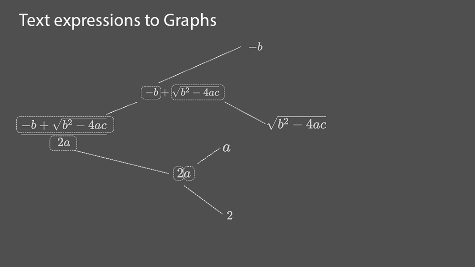

# axioms_2: The Math Engine

The calculators' runtime environment is an application to manipulate mathematical expressions. This environment has been split into 2 parts. A UX and a math engine. The UX calls upon the math engine to perform symbolic math operations that we define with custom syntax. This section covers the functionality of the math engine "axioms_2.py".

- [Initializing expressions](###Instantiating-an-expression-object)
- [Evaluating expressions](##Evaluate)
- [Inverting expresssions](##Inverting-expressions)
- [Derivatives](##Derivative)
- [Taylor expansion](##Taylor-Expansion)
- [Common Form](##Common-Form)

## Introduction to expression graphs

"axioms_2.py" is a collection of functions and classes that work on binary trees. These trees and functions are analogous to symbolic math humans work with. Because axioms_2 is built heavily on binary trees it is helpful to know in general what a graph is and more specifically what a binary tree is. 

- [Graphs](https://en.wikipedia.org/wiki/Graph_(discrete_mathematics))
- [Binary Tree](https://en.wikipedia.org/wiki/Binary_tree)

Math expressions can be described with binary trees. For example, an expression $a+b$ can be saved as follows. 

```python
class node:
    def __init__(self,val,left=None,right=None):
        self.val = val
        self.left = left
        self.right = right

root = node('+',left = node('a'), right = node('b'))
'''
 + 
/ \
a b
'''
```
```root``` points to the base operation $+$ with left and right nodes $a$ and $b$. This structure can grow to save any arbitrary math expression. 


## Quickstart

To import the math engine axioms_2 into a python environment

```python
from axioms_2 import expr
```

`expr` is an object class with instance variables `root` and `dir`. The value of `root` is the base node of an expression tree. `dir` is a dictionary, with keys as variables and values as a list of paths to each variable. 

expr.__init__() automates defining the nodes and edges of the binary tree. This process replicates the PEMDAS order of operation. Below is a figure demonstrating how __init__() decomposes a text expression into a binary tree. 



The +quadratic formula is broken up into nodes and edges where nodes are operations that operate on left and right values. Left and right values are sub-expressions. Eventually, sub-expressions are values that have no left or right nodes. 

### Instantiating an expression object
```python
from axioms_2 import expr
sum_ab = expr('a+b')
sum_ab.display()
'''
 + 
/ \
a b
'''
print(sum_ab)
'a+b'
```
Here it is also shown how the function `.display()` creates text art that helps visualize the binary tree that an ```expr``` object saves. An expression can also be printed as shown. Below is a table of operators and their descriptions.

| Operation      | Description |
| ----------- | -----------     |
| =      | equivalency          |
| +      | addition             |
| -      | subtraction          |
| *      | multiplication       |
| /      | division             |
| ^      | exponentiation       |
| &      | logical and          |
| \|      | logical or           |
| <     | less than              |
| <=    | less than equal to     |
|>| greater than
|>=| greater than equal to|
|==| equal to|
|( | left expression delimiter|
|} | right expression delimiter|
| f(x)| $f(x)$ notation|


Noted that function notation $f(x)$ is recognized for any arbitrary function. However, there are reserved and arbitrary functions. The reserved functions below are instantiated differently than arbitrary functions. The argument of a reserved function is decomposed into a binary tree. How arbitrary functions are handled is explained in [arbitrary function](###Arbitrary-function).

| $f(x)$      | Description |
| ----------- | -----------     |
| exp(x)      | exponential()     |
|ln(x)          | $ln(x)$|
| sin(x)      | $sin(\theta)$|
| cos(x)      | $cos(\theta)$|
| tan(x)      | $tan(\theta)$|
| csc(x)      | $csc(\theta)$|
| sec(x)      | $sec(\theta)$|
| cot(x)      | $cot(\theta)$|
| asin(x)      | $arcsin(\theta)$|
| acos(x)      | $arccos(\theta)$|
| atan(x)      | $arctan(\theta)$|


### Arbitrary function

Parts of expressions that are formatted as ```"f(arg1,arg2)"``` are saved differently than reserved expressions. They are saved with the structure below.

```python
"f(arg1,arg2)"

f = node(
    'f',
    right=node(['arg1','arg2']))
```
The above demonstrates how ```"f"``` is the val of a node with its right pointer pointing to a node with ```val``` equal to a list of the comma-separated arguments

This is demonstrated by the code below. 

```Powershell
>>> from axioms_2 import expr
>>> expr('f(arg1,arg2)').display()
f________        
         \       
 ['arg1', 'arg2']

```


### Recognized values
There are a few string values and formats that are recognized within expressions.


Recognized values that are saved in a ```node.val```
- "True" => ```True```
- "False" => ```False```
- "e"=> 2.71828... (Euler's number)
- "pi" =>  3.1415... ($\pi$)

Where $a$ and $b$ are a string of digits (```a.isdigit() and b.isdigit()=>True```)
- "a" => ```int(a)```
- "a.b" =>  ```float(a.b)```
- "a.bj" => ```complex(a.bj)```

Structures
- "-a" => -1*a
- f(x) => ```node('f',right = node(x))```

Variables

Are any combination of alphanumeric values so long as it starts with a character. For example, where "*" represents an alphanumeric str and "a" is a character. 

- "a*" => a*


## Evaluate
```.evaluate()``` attempts to collapse a binary tree to a single value. If the expression tree cannot collapse ```.evaluate()``` returns ```None```. Variables can be evaluated as values if the keywarg ```val_dict``` is passed with keys and values defined as follows

```val_dict = {'var':val}```

Examples
```PowerShell
>>> from axioms_2 import expr
>>> expr('1+2').evaluate()
3
>>> expr('a+b').evaluate()
>>> expr('a+b').evaluate(val_dict = {'a':1,'b':2})
3
```

## Inverting expressions
```.invert_branch()```This is a useful function that is roughly analogous to inverting a binary tree. However, it differs in that it performs a mathematical inversion of a variable.

Let's consider the following expression
$$
a+b=c
$$
The nodes of variables "a" and "b" can be inverted to generate new expressions as described in the code below

```python
from axioms_2 import expr

sum_ab = expr('a+b=c')
a = sum_ab.invert_branch('a')
b = sum_ab.invert_branch('b')

print(a)
"c-b"
print(b,True)
"b=c-a"
```
There are a few things to note. ```.invert_branch()``` inverts the first occurrence of its's argument var in the expression. If the second parameter ```include_var``` is passed as ```True```. Then the returned expression will be saved as "var=...".
Boolean operations cannot be inverted.

## Derivatives
This library can take [partial derivatives](https://en.wikipedia.org/wiki/Partial_derivative) of expressions.

It should be noted that this is only for differentiable expressions. This does not include boolean expressions. 

```expr.pD(var)```


|Parameter| Description|
|-----|------|
|var | the variable for which to differentiate to |

```python
from axioms_2 import *

poly = expr('a*x^2+b*x+c')

print(poly.pD('x'))
'b+2*a*x'
```
The form may look awkward but that's because ```.pD()``` takes advantage of [``common_form()``](##Common-Form). 


## Taylor Expansion
The Taylor function is an extension of the derivative function. For more information on [Taylor series](https://en.wikipedia.org/wiki/Taylor_series).


$$
\ taylor(var,a,depth) = \sum_{n=0}^{depth} \frac{f^n(a)}{n!} (x-a)^n  \
$$


```expr.taylor_series(var,a,depth)```
|Parameter| Description|
|-----|------|
|var | the variable for which to differentiate to |
|a   | the point at which to evaluate the derivative and offset the polynomial|
|depth | how many terms of the series to include|

The code below shows how an expression is expanded into a Taylor series.

```python
from axioms_2 import expr

poly = expr('a*x^2+b*x+c')
print(poly.taylor_series('x','xo',2))

'a*xo^2+b*xo+c+(b+2*a*xo)/1*(x-xo)^1+(2*a)/2*(x-xo)^2'
```

## Common Form
Common form attempts to reduce expressions into more readable forms and perform a sort such that expressions that are equivalent via commutation and combination will be returned as the same tree.

```expr.common_form()```

```python
from axioms_2 import expr, equals

poly1 = expr('a*x^2 + b*x + c')
poly2 = expr('b*x + c + a*x^2')

root1 = poly1.common_form().root
root2 = poly2.common_form().root

print(equals(root1,root2))
'True'
```

# Calculator Runtime Environment
The calculator runtime environment creates a graphical interaface and environment for the use to
interact with. Qt is used to handle graphics and user inputs, while the Math Engine is used to perform
the calculations for the user. 

The following image shows a general overview of the application structure.


### State Class
The `State` class contains the current state of the application.
it provides methods which can be used to modify the state, or be bound
to commands which are then typed by the user.

this design pattern allows the interface type to be easily interchangable (ie, output
using curses to terminal, create a custom window with a graphcis library such as WebGPU
or OpenGL and draw to a pixel buffer, or use Qt, which is what this project uses.)

### Command Class
Every command is a subclass of the the `Command` class. One instance of each command subclass must be created.
Upon instantiation, each instance stores a reference to itself in a static parameter of the `Command` class.

when a command is entered, this static list stored in `Command` is queried, and any function or data associated
with the subclass can be gathered. This design allows for all information related to a command to be stored in
one location

### Exp Class
`Exp` class is an extension (subclass) of the axioms_2 `expr` class. `Exp` in addition to everything that `expr` does, `Exp`
allows previously defined expressions to be referenced in new expressions, through special functions. for example:

```
    A: a+b=c
    B: invert(A, b) + a
    eval B
        B <- c - a + a
```

the `invert()` function references expressions A, which is external to the math engine. Functions such as this
are made possible by the Exp subclass.
